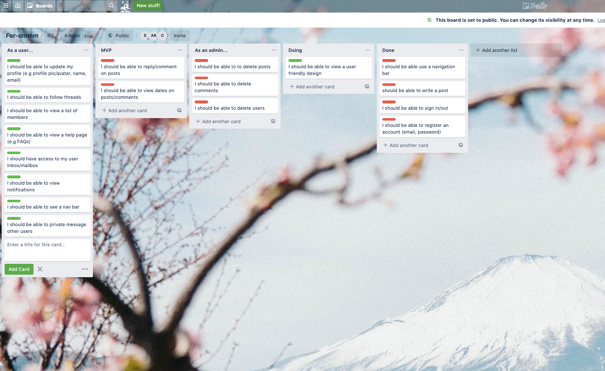
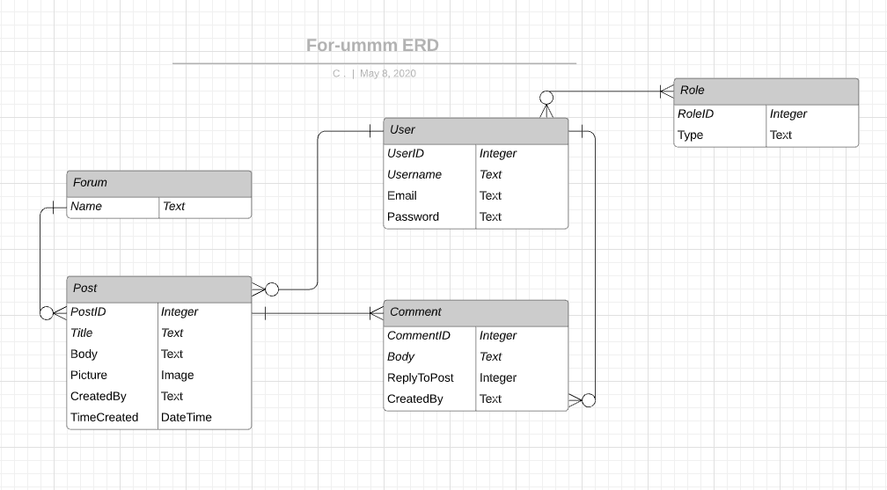

# For-ummm

## Who are we?
CAS Corp is technology company aiming to provide the best forum services to our users. The name CAS comes from the initials of the first name of the founders Conrad, Aaron and Stephanie taking inspiration from other successful groups such as ABBA, NSYNC and the BeeGees. We wanted a name that incorporated each founder but we were humble enough to only include the first letters of our first names. The forum site was built to solve the problem of developers having a safe place to discuss different topics and share ideas. For-ummm provides this with a fun and easy-to-use website with an ever-growing community. 

Why the name For-ummm you ask? Well simply put it is because prior to development our founders had absolutely no idea on how to build a forum engine. In addition to this other tech companies like to use single lower-case letters to show off their company logo well guess what? For-ummm has set a global trend of adding unnecessary extra letters to the end. Thats right a lot trendsetting going on here at the CAS Campus. (Copyright pending).


## What is For-ummm?
For-ummm is a general pupose forum engine where users can post and create a discussion with fellow users on whatever topic they like. Users have the ability to create, view, edit and delete posts. 

## How to post
New users can sign up using their email addresses and once the account is created they have the ability to post their own forum topic.

## User friendliness
For-ummm has a splash page that welcomes users. The splash page is minimalist in design to encourage users to explore the content of the site.

## Gems used

```
gem "devise", "~> 4.7"

gem "rolify", "~> 5.2"

gem "cancancan", "~> 3.1"

gem "aws-sdk-s3", "~> 1.63"
```

Devise was used to authenticate the user so that they can perform CRUD operations in the forum

Rolify was used to apply roles to the users.

Cancancan used to define roles of certain users

AWS-sdk store and upload images.

## Trello board


## Entity Relationship Diagram




